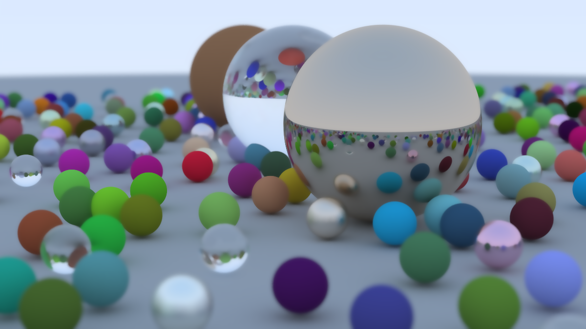

# Ray tracer in TS

Based off of the excellent [Ray Tracing in One Weekend](https://raytracing.github.io/books/RayTracingInOneWeekend.html#overview)

## To run:

```
pnpm i
pnpm run dev
```

The paramaters of the camera and the setup of material and objects in the world are all located in `.main.ts`

 
