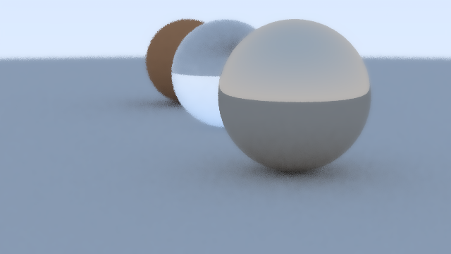

# Ray tracer in TS

Based off of the excellent [Ray Tracing in One Weekend](https://raytracing.github.io/books/RayTracingInOneWeekend.html#overview)

## To run:

```
make run
```

takes about ~13mins on my machine to run

The paramaters of the camera and the setup of material and objects in the world are all located in `./cmd/main.go`

 
